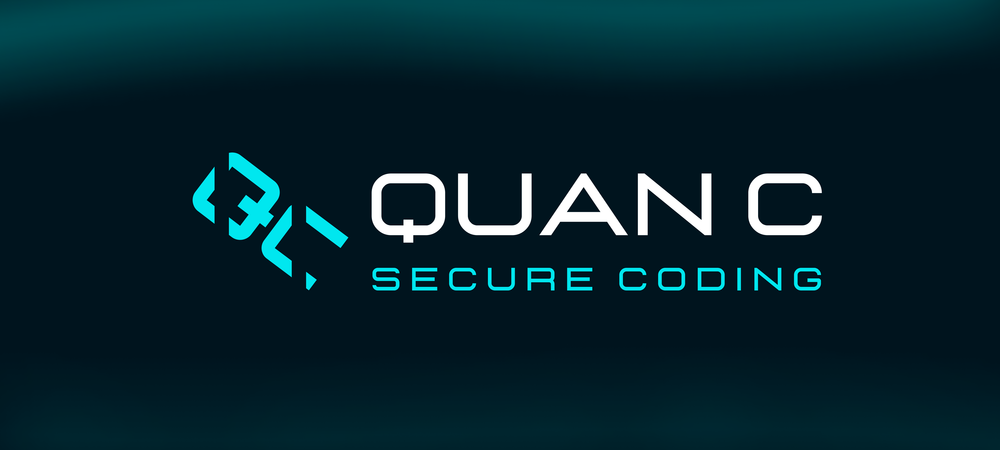

# Quan-C Secure Coding

<div align="center">



<br>


</div>

## Quan C
<b>Quan C</b> is an open source Secure Programming Platform that aims to train developers and IT security practitioners to level up their secure programming knowledges and skills.

## Usage
Quan C is designed to be flexible for different types of users:
- <u><b>Organizations </b> </u> \
If your organization wants to train employees on specific code vulnerabilities (including those you've encountered in your own systems), you can deploy the app internally and customize the challenges to address those specific issues.

- <u><b>Educators </b> </u> \
For users looking to provide secure coding challenges as part of a curriculum, you can deploy Quan C yourself and set challenges tailored to your students' needs.

- <u><b>Learners </b> </u> \
If you're just looking to improve your secure coding skills without the need to deploy or create custom challenges, you can use the set of challenges we've provided, covering a range of vulnerabilities.

## Key Features
- <u><b>Case Solving </b> </u> \
Quan C enables users to learn secure coding through hands-on, experiential learning by solving real-world cases available within the system. Users can upload their solution to each challenge, and our system will automatically validate it by executing the code and testing the application using pre-configured payloads to ensure it meets the requirements.

- <u><b>Leaderboards </b></u> \
Compete with others by solving cases and racing to secure the top spot on the leaderboard. Your rank is determined by how quickly you solve problems compared to other users, showcasing both your speed and expertise in secure coding.

- <u><b>Collaborate With Us </b></u> \
Have a case in mind? Help improve our platform by recommending new challenges and contribute to creating a more robust learning experience for all users.

## Minimum Software Requirements
- Python 3.9.x
- Pip 24.x
- NodeJS 20.9.x
- npm 10.x.x
- Powershell 7 (for Windows only)

## Minimum Hardware Requirements
- Windows 10/11, Server 2019/2022
- Ubuntu 22.04
- vCPU 4 Cores
- RAM 8 GB
- Storage 16 GB

## Quick Start
#### For MacOS user, please refer to [MacOS User Guide](/user-guide/macos.md)
#### For Windows user, please refer to [Windows User Guide](/user-guide/windows.md)
These are the steps to setup and run our program.

1. Run setup script <b>(First time setup only)</b>
    ```
    $ sudo chmod +x setup.sh
    $ ./setup.sh
    ```

2. Setup your .env files. For the detailed guide, please refer to this [documentation](/user-guide/env.md)

3. Insert GitHub ID to populate your database for application admin in this [file](/server/populate_db.js) <b>(OPTIONAL)</b>

    To check GitHub ID, hit this API:
    ```
    https://api.github.com/users/your_github_user_name
    ```

4. Launch the server
    ```
    $ ./start.sh
    ```


## Contributors
- [xhfmvls](https://github.com/xhfmvls)<br>
- [vhsxuz](https://github.com/vhsxuz)<br>
- [newdna](https://github.com/newdna)