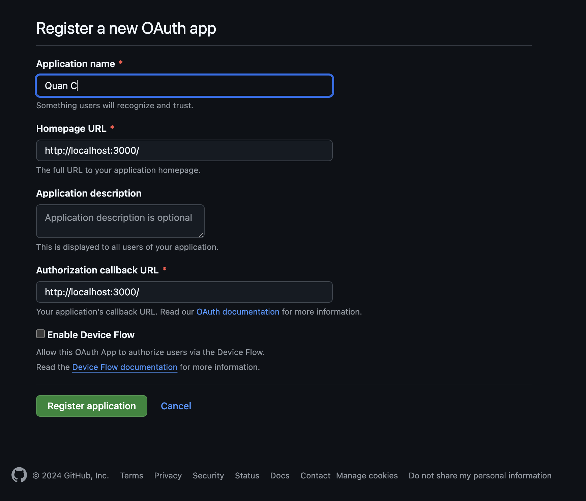

# How to Setup Your Environment File
These sections will run you through on what you need to prepare for your .env files. 

<b>Note that every server has their own .env example prepared for you!</b>

## Table of Contents
- [Setup Github Client](#setup-github-client)
- [Database Setup Guide](#database-setup-guide)

## Setup GitHub Client
First of all, we will be using GitHub OAuth for the application, therefore you must set the GitHub Client first.
1. Access [Developer Settings](https://github.com/settings/developers) in Github.

2. Select OAuth Apps

3. Create new OAuth App


4. Add application informations (The image below is just an example. Fill it with your own information)


5. Create Client Secret


6. Insert the Client ID and Client Secret in 
  - [client .env](../client/.env)
  - [admin panel .env](../server/.env) (if needed)
  - [server .env](../server/.env)


<br>

# Database Setup Guide
In this guide, we will run you through on how to prepare your databases.

## Login to MySQL Server
### Windows
<b>Run MySQL configurator if you haven't setup any MySQL Server beforehand.</b> 

Then login to the server:

```
PS> mysql -u root
```
or this if your root is password protected:
```
PS> mysql -u root -p
```

### Linux
```
$ sudo mysql -u root
```

## Create User with Admin Privilege
<b>Make sure to remember the admin, password and the address!</b>
```
mysql> create user '$USER'@'$ADDRESS' identified by '$PASSWORD';

mysql> grant all privileges on *.* to '$USER'@'$ADDRESS';

mysql> flush privileges;
```
<br>
