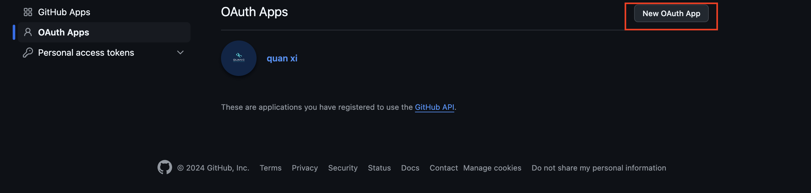
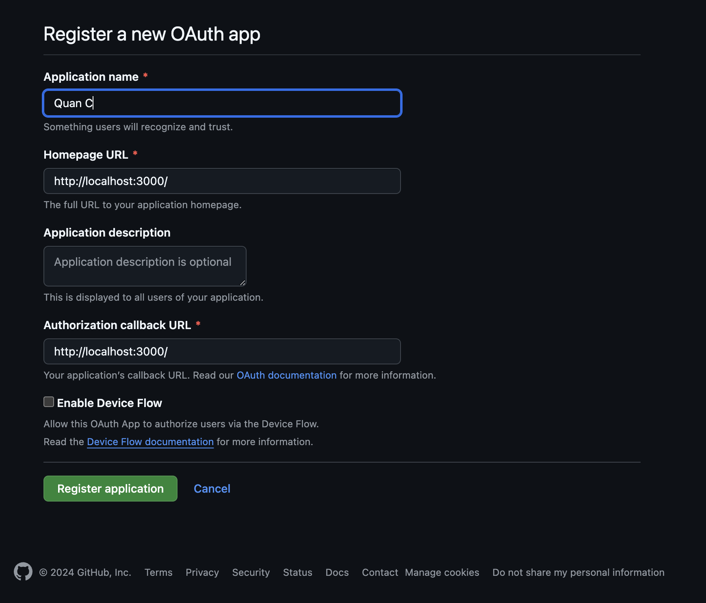
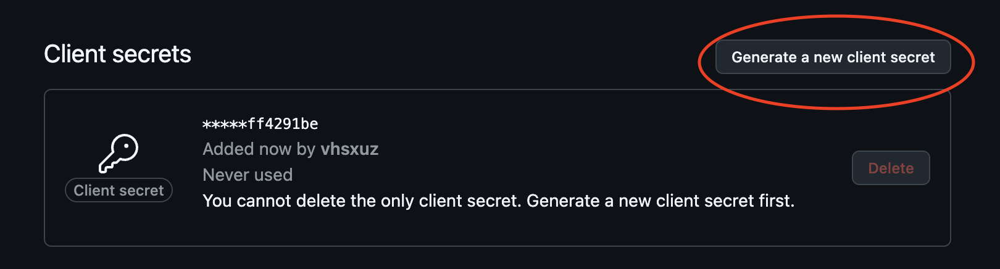

# Mac OS Installation Guide

## Table of Contents

- [Installation](#installation)
  - [Pre-requisites](#pre-requisites)

- [Setup GitHub Client](#setup-github-client)
- [Getting Started](#getting-started)

## Installation

### Pre-requisites
1. [Docker](https://docs.docker.com/desktop/install/mac-install/)
2. [MySQL](https://dev.mysql.com/downloads/file/?id=531917)
3. [Python](https://www.python.org/downloads/macos/)
4. [NodeJS](https://nodejs.org/en/download/package-manager)


## Setup Github Client
1. Access [Developer Settings](https://github.com/settings/developers) in Github.
2. Select OAuth Apps
3. Create new OAuth App

4. Add application informations (The image below is just an example. Fill it with your own information)

5. Create Client Secret

6. Create .env file in these directories
  - client
  - admin-panel (if needed)
  - server
  - runner
7. Insert the client secret in 
  - [client .env](../client/.env)
  - [admin panel .env](../server/.env) (if needed)
  - [server .env](../server/.env)
  - [runner .env](../runner/.env)
```
CLIENT_SECRET=[Github Client Secret]
CLIENT_ID=[Github Client ID]
```


## Getting Started
1. Clone the project
```
https://github.com/ProjectQuanC/quan-c-app.git
cd quan-c-app/
```
2. Run the Script
```
sh start_mac.sh
```

3. go to http://localhost:3000

